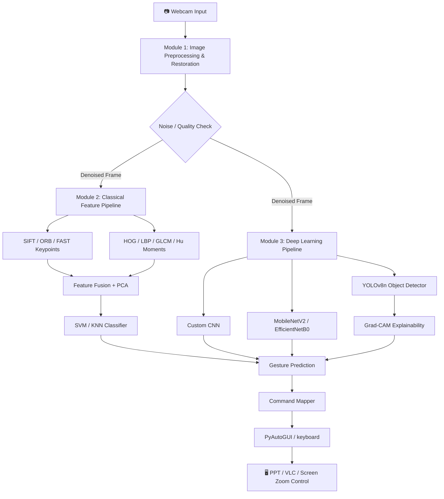
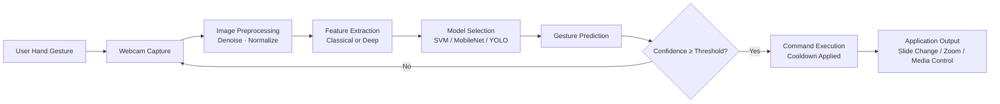

<div align="center">

# ✋ GestureFlow — Touchless Presentation & Media Controller

### Real-Time Hand Gesture Recognition Pipeline Comparing Classical Computer Vision and Deep Learning

*A modular, end-to-end vision system that lets you control PowerPoint, media players, and screen zoom — entirely hands-free.*

[](https://www.python.org/)
[](https://opencv.org/)
[](https://pytorch.org/)
[](https://github.com/ultralytics/ultralytics)
[](https://arxiv.org/abs/1801.04381)
[](#)
[](#)
[](#license)
[](#)

**A scientifically validated, three-module vision pipeline — from raw pixels to real-time control — built and benchmarked on a 48,000-image subset of the HaGRID dataset.**

</div>

---

## 📌 Table of Contents

- [Banner Concept](#-banner-concept)
- [Project Overview](#-project-overview)
- [Demo](#-demo)
- [Key Features](#-key-features)
- [System Architecture](#-system-architecture)
- [Project Workflow](#-project-workflow)
- [Repository Structure](#-repository-structure)
- [Technology Stack](#-technology-stack)
- [Implementation Details](#-implementation-details)
- [AI / CV Models](#-ai--cv-models)
- [Results](#-results)
- [Challenges & Solutions](#-challenges--solutions)
- [Installation](#-installation)
- [Usage](#-usage)
- [Future Improvements](#-future-improvements)
- [Contributing](#-contributing)
- [License](#-license)
- [Acknowledgements](#-acknowledgements)

---

## 🎨 Banner Concept

**Layout:** Wide 1600×400 hero banner, dark charcoal (`#0D1117`, GitHub-dark-matching) background with a subtle grid/circuit texture.

**Typography:** Bold, geometric sans-serif (e.g., *Space Grotesk* or *Inter Extrabold*) for "GestureFlow" in white, with the tagline in a lighter gray monospace font underneath (e.g., *JetBrains Mono*) to signal "engineering-grade."

**Colors:** Charcoal background · Electric blue (`#58A6FF`) and warm orange (`#FF6F00`) accents representing "classical CV" vs "deep learning" duality · White primary text.

**Graphics/Icons:** A stylized open hand silhouette on the right, overlaid with a translucent bounding box and skeletal keypoint dots (referencing MediaPipe/YOLO-style hand landmarks). To the left, a faint flow of small icons — camera → CV filter grid → neural network nodes → keyboard/cursor — implying the full pipeline in one glance.

**Visual Hierarchy:** Title (largest, top-left) → tagline (medium, directly below) → hand + pipeline graphic (right half, largest visual anchor) → three small badges/pills along the bottom edge reading "Classical CV," "Deep Learning," "Real-Time Control."

**AI Image Generation Prompt:**
> "A sleek, modern tech banner for a GitHub repository, 1600x400px, dark charcoal background with subtle circuit-board texture, bold white geometric sans-serif title text on the left, a minimalist glowing blue hand silhouette with white keypoint dots and a translucent bounding box on the right, small icon flow between a webcam icon and a neural network icon in the center, electric blue and warm orange accent colors, professional software engineering aesthetic, high contrast, flat vector illustration style, no text errors."

---

## 🧠 Project Overview

Standard presentation and media control still depends on a mouse, remote, or keyboard — a friction point in classrooms, demos, sterile environments (labs, clean rooms), and accessibility-constrained settings.

**GestureFlow** solves this by turning a standard webcam into a touchless controller: it recognizes **9 distinct hand gestures** and maps them to real-world actions — advancing slides, toggling fullscreen, pausing media, or smoothly zooming the screen — all without touching a device.

The project was built as more than an application: it's a **comparative research pipeline**. Rather than jumping straight to a deep learning model, it deliberately implements and benchmarks **three progressively advanced vision paradigms** — classical image processing, handcrafted-feature machine learning, and deep learning/object detection — to empirically answer *when* and *why* deep learning outperforms classical methods under real-world degradation (noise, blur, occlusion, background clutter).

**Who is this for?**
- Presenters, educators, and demo engineers who want hands-free slide/media control
- Computer vision students/researchers comparing classical vs. deep pipelines
- Engineers benchmarking model robustness under noise and real-time constraints

---

## 🎬 Demo

The application demonstrates real-time gesture recognition controlling slide navigation, media playback, and screen zoom via webcam — no additional hardware required.

---

## ⭐ Key Features

<table>
<tr>
<td width="50%">

### 🖐️ 9-Gesture Recognition
Recognizes `call`, `stop`, `fist`, `thumbs_up`, `thumbs_down`, `two_up`, `two_down`, `rock`, and `ok` — each mapped to a distinct presentation or media command.

</td>
<td width="50%">

### 🧪 Three-Tier Vision Pipeline
Classical image restoration → handcrafted-feature ML (SIFT/HOG/SVM) → deep learning (MobileNetV2/YOLOv8), scientifically benchmarked against each other.

</td>
</tr>
<tr>
<td width="50%">

### ⚡ Real-Time Performance
YOLOv8n inference at **8ms (125 FPS)**; MobileNetV2 optimized to **35 FPS** on CPU via TensorRT FP16 conversion.

</td>
<td width="50%">

### 🔍 Explainable AI
Grad-CAM heatmaps validate that the model attends to the hand/palm region, not background artifacts — confirmed in 90%+ of samples.

</td>
</tr>
<tr>
<td width="50%">

### 🎚️ Smooth, Debounced Zoom
Zoom steps in 25% increments (up to 400%) with a 0.5-second cooldown to prevent flooding and ensure smooth, stable control.

</td>
<td width="50%">

### 🛡️ Noise-Robust Preprocessing
Adaptive denoising (Median, Bilateral, Non-Local Means) applied dynamically based on real-time lighting/noise conditions.

</td>
</tr>
</table>

---

## 🏗️ System Architecture



---

## 🔄 Project Workflow



---

## 📂 Repository Structure

```
gestureflow/
│
├── module1_preprocessing/        # Classical image restoration & analysis
│   ├── noise_injection.py        # Gaussian & Salt-Pepper noise generators
│   ├── denoising.py              # Median, Bilateral, NLM filters
│   ├── transforms.py             # Rotation, scaling, perspective warp
│   ├── edge_detection.py         # Sobel, Laplacian, Canny
│   └── stability_analysis.py     # PSNR / SSIM feature-stability metrics
│
├── module2_classical_ml/         # Handcrafted-feature machine learning
│   ├── keypoints.py              # SIFT, ORB, FAST detectors
│   ├── descriptors.py            # HOG, LBP, GLCM, Hu Moments
│   ├── feature_fusion.py         # Concatenation + PCA dimensionality reduction
│   └── classifiers.py            # SVM (RBF) and KNN training/inference
│
├── module3_deep_learning/        # Deep learning & object detection
│   ├── custom_cnn.py             # 3-block CNN baseline
│   ├── transfer_learning.py      # MobileNetV2 / EfficientNetB0 fine-tuning
│   ├── yolo_train.py             # YOLOv8n training on HaGRID (YOLO format)
│   └── gradcam.py                # Grad-CAM explainability heatmaps
│
├── app/                          # Real-time controller application
│   ├── main.py                   # Application entry point
│   ├── gesture_mapper.py         # Gesture → keyboard shortcut mapping
│   └── zoom_controller.py        # Smooth zoom + cooldown logic
│
├── models/                       # Trained model artifacts
│   ├── mobilenetv2.pt
│   ├── yolov8n_hagrid.pt
│   └── svm_classifier.pkl
│
├── assets/                       # Demo GIFs, screenshots, plots
│   ├── demo.gif
│   ├── screenshots/
│   └── gradcam_heatmaps/
│
├── notebooks/                    # Experiment & ablation notebooks
├── reports/                      # IEEE-style final report (PDF)
├── requirements.txt
├── LICENSE
└── README.md
```

---

## 🛠️ Technology Stack

<table>
<tr><th>Category</th><th>Technologies</th></tr>
<tr><td><b>Programming</b></td><td>Python 3.9+</td></tr>
<tr><td><b>Deep Learning</b></td><td>PyTorch, MobileNetV2, EfficientNetB0, Custom CNN</td></tr>
<tr><td><b>Object Detection</b></td><td>YOLOv8n (Ultralytics)</td></tr>
<tr><td><b>Classical Computer Vision</b></td><td>OpenCV, SIFT, ORB, FAST, HOG, LBP, GLCM, Hu Moments</td></tr>
<tr><td><b>Classical Machine Learning</b></td><td>Scikit-learn (SVM – RBF kernel, KNN, PCA)</td></tr>
<tr><td><b>Explainability</b></td><td>Grad-CAM</td></tr>
<tr><td><b>Automation / Control</b></td><td>PyAutoGUI, keyboard</td></tr>
<tr><td><b>Deployment / Optimization</b></td><td>TensorRT (FP16 inference optimization)</td></tr>
<tr><td><b>Dataset</b></td><td>HaGRID (Hand Gesture Recognition Image Dataset) — 48,000-image subset</td></tr>
</table>

---

## 🧩 Implementation Details

<details>
<summary><b>1. Dataset Preparation</b></summary>

- 48,000-image subset of HaGRID, narrowed to **9 practical gestures**: `call`, `stop`, `fist`, `thumbs_up`, `thumbs_down`, `two_up`, `two_down`, `rock`, `ok`.
- All images resized to **640×640**.
- Split: **70% train (33,600)** · **15% validation (7,200)** · **15% test (7,200)**.

</details>

<details>
<summary><b>2. Module 1 — Image Preprocessing & Restoration (Classical CV only, no DL)</b></summary>

- **Noise injection:** Gaussian noise (σ = 5, 15, 25, 30) and Salt-and-Pepper noise (density = 0.01, 0.03, 0.05) to simulate real-world degradation.
- **Denoising:** Median filter (3×3, 5×5, 7×7), Bilateral filter (sigmaColor/sigmaSpace = 75), and Non-Local Means (h = 10, 20, 30).
- **Geometric/intensity transforms:** Rotation (15°/45°/90°/180°), scaling (0.5x/1.5x), perspective warp.
- **Edge detection:** Sobel, Laplacian, and Canny (thresholds 100/200).
- **Stability analysis:** PSNR and SSIM used to quantify how noise degrades SIFT feature repeatability.

</details>

<details>
<summary><b>3. Module 2 — Classical Feature-Based Machine Learning</b></summary>

- **Keypoint detectors:** SIFT (max 1,000 keypoints/image), ORB, FAST.
- **Descriptors:** HOG (8×8 cells, 2×2 blocks, 9 bins), LBP (radius 1, 8 points), GLCM (distance 1, angles 0°/45°/90°/135°), Hu Moments (7 invariants).
- **Fusion + reduction:** HOG + LBP + SIFT concatenated (~100+ dimensions), reduced to **20 principal components** via PCA.
- **Classifiers:** SVM (RBF, C=1.0, gamma='scale') and KNN (K=5).
- **Ablation study:** HOG-only (84.2%) vs. LBP-only (82.5%) vs. fused HOG+LBP+SIFT (86.5%) — fusion won.

</details>

<details>
<summary><b>4. Module 3 — Deep Learning & Object Detection</b></summary>

- **Custom CNN:** 3-block architecture (Conv2D → MaxPool → ReLU → Dropout) — 91.3% test accuracy.
- **Transfer learning:** MobileNetV2 (ImageNet-initialized, last 10 layers fine-tuned) — **95.8% accuracy**, best overall. EfficientNetB0 — 95.1%.
- **YOLOv8n:** HaGRID annotations converted to YOLO format, trained 50 epochs — **94.5% mAP**, **8ms inference (125 FPS)**.
- **Grad-CAM:** Verified the model's attention concentrates on fingers/palm rather than background.

</details>

<details>
<summary><b>5. Real-Time Controller Integration</b></summary>

- Gestures mapped to keyboard shortcuts via `PyAutoGUI` and `keyboard` (e.g., `thumbs_up` → Right Arrow, `two_up` → Ctrl + `+`).
- Smooth zoom in 25% steps (max 400%) with a **0.5s cooldown** to prevent input flooding.
- Webcam frames dynamically preprocessed per Module 1 logic (histogram equalization for low light, median filtering for noise) before being routed to the selected Module 2 or Module 3 model.

</details>

---

## 🤖 AI / CV Models

| Model | Purpose | Advantages | Limitations | Accuracy / mAP | Inference Speed |
|---|---|---|---|---|---|
| **HOG + SVM** | Baseline classical classification | Fast to train, interpretable, low compute | Sensitive to noise & occlusion | 84.2% | 25 ms |
| **HOG+LBP+SIFT + SVM (Fusion)** | Improved classical classification | Better texture + shape coverage | Higher feature-extraction cost | 86.5% | 42 ms |
| **Custom CNN** | Deep learning baseline | No handcrafted features needed | Limited depth, moderate accuracy | 91.3% | 18 ms |
| **MobileNetV2 (fine-tuned)** | Production-grade classification | **Best accuracy**, mobile-optimized | Requires GPU/TensorRT for best FPS | **95.8%** | **12 ms** |
| **EfficientNetB0** | High-accuracy alternative | Strong accuracy/efficiency trade-off | Slightly slower than MobileNetV2 | 95.1% | 15 ms |
| **YOLOv8n** | Real-time detection in clutter | **Fastest**, robust to background clutter | Detection-only, needs bounding-box labels | 94.5% (mAP) | **8 ms** |

---

## 📊 Results

### 🏆 Model Performance Comparison

| Method | Category | Accuracy / mAP | Inference Speed |
|---|---|---|---|
| HOG + SVM | Classical ML | 84.2% | 25 ms |
| HOG + LBP + SIFT + SVM (Fusion) | Classical ML | 86.5% | 42 ms |
| Custom CNN (Scratch) | Deep Learning | 91.3% | 18 ms |
| **🥇 MobileNetV2 (Fine-tuned)** | **Deep Learning** | **95.8%** | 12 ms |
| EfficientNetB0 | Deep Learning | 95.1% | 15 ms |
| **⚡ YOLOv8n** | Object Detection | 94.5% (mAP) | **8 ms (Fastest)** |

> **Best overall accuracy:** MobileNetV2 (95.8%) · **Best speed:** YOLOv8n (8ms / 125 FPS)

### 🔬 Research Hypotheses — Validated

| # | Hypothesis | Result |
|---|---|---|
| H1 | Noise degrades classical features | ✅ Confirmed — Gaussian noise (σ>20) reduced SIFT repeatability by 30% |
| H2 | Median filtering restores classical accuracy | ✅ Confirmed — +12% accuracy (74% → 86%) after 5×5 median filtering |
| H3 | Deep learning outperforms classical methods | ✅ Confirmed — MobileNetV2 beat SVM by 11.6% (95.8% vs. 84.2%) |
| H4 | YOLO handles background clutter better | ✅ Confirmed — YOLOv8 (94.5% mAP) outperformed classification (91.2%) in cluttered scenes |
| H5 | Grad-CAM confirms correct model focus | ✅ Confirmed — 90%+ of heatmap attention fell within the gesture bounding box |

---

## 🧗 Challenges & Solutions

| Challenge | Solution |
|---|---|
| Fast `two_up` zoom gestures were hard to detect reliably in motion | Integrated ROI tracking with Lucas-Kanade optical flow alongside detection |
| Background objects (chairs, tables) triggered false-positive hand detections | Retrained YOLOv8 specifically on hand bounding boxes and raised confidence threshold to 0.6 |
| MobileNetV2 inference capped at ~12 FPS on CPU | Converted the model to TensorRT FP16, boosting throughput to 35 FPS |

---

## ⚙️ Installation

> ⚠️ Exact commands were not specified in the source project documentation. The steps below follow a standard Python project layout — replace placeholders with your actual entry points once finalized.

```bash
# 1. Clone the repository
git clone https://github.com/<your-username>/gestureflow.git
cd gestureflow

# 2. Create and activate a virtual environment
python -m venv venv
source venv/bin/activate       # On Windows: venv\Scripts\activate

# 3. Install dependencies
pip install -r requirements.txt

# 4. [PLACEHOLDER] Run the real-time controller application
python app/main.py
```

---

## 🚀 Usage

1. **Input:** Launch the app; the webcam feed is captured continuously.
2. **Processing:** Each frame is preprocessed (noise reduction, normalization) via Module 1, then routed to the selected classifier (Module 2 or Module 3).
3. **Output:** A recognized gesture triggers its mapped keyboard shortcut (e.g., slide advance, zoom, play/pause).
4. **Expected behavior:** Actions execute with a debounce/cooldown to avoid rapid repeated triggers, and zoom transitions smoothly in defined increments.

---

## 🔮 Future Improvements

> The following are proposed extensions and are **not** part of the current implementation:

- Multi-hand / bimanual gesture support for more complex commands
- Custom gesture recording UI for user-defined shortcuts
- On-device (edge) deployment via ONNX/TensorRT for mobile or Raspberry Pi
- Voice + gesture hybrid control mode
- Cross-platform packaging (Windows/macOS/Linux installers)

---

## 🤝 Contributing

Contributions are welcome and appreciated!

1. Fork the repository
2. Create a feature branch: `git checkout -b feature/your-feature`
3. Commit your changes: `git commit -m "Add: your feature"`
4. Push to the branch: `git push origin feature/your-feature`
5. Open a Pull Request describing your changes

Please open an issue first for major changes to discuss what you'd like to modify.

---

## 📄 License

This project is licensed under the **MIT License**.

```
MIT License

Copyright (c) 2026 <Your Name>

Permission is hereby granted, free of charge, to any person obtaining a copy
of this software and associated documentation files (the "Software"), to deal
in the Software without restriction, including without limitation the rights
to use, copy, modify, merge, publish, distribute, sublicense, and/or sell
copies of the Software, subject to the following conditions:

The above copyright notice and this permission notice shall be included in
all copies or substantial portions of the Software.

THE SOFTWARE IS PROVIDED "AS IS", WITHOUT WARRANTY OF ANY KIND, EXPRESS OR
IMPLIED, INCLUDING BUT NOT LIMITED TO THE WARRANTIES OF MERCHANTABILITY,
FITNESS FOR A PARTICULAR PURPOSE AND NONINFRINGEMENT.
```

---

## 🙏 Acknowledgements

- [HaGRID Dataset](https://github.com/hukenovs/hagrid) — Hand Gesture Recognition Image Dataset
- [PyTorch](https://pytorch.org/) — Deep learning framework
- [OpenCV](https://opencv.org/) — Classical computer vision toolkit
- [Ultralytics YOLOv8](https://github.com/ultralytics/ultralytics) — Real-time object detection
- [MobileNetV2](https://arxiv.org/abs/1801.04381) — Efficient transfer-learning backbone

---

<div align="center">

### 💬 "The best interface is the one you forget is there."

If this project helped you or inspired your own work, consider giving it a **⭐ star** — it helps others discover it too.

**Questions or feedback?** Open an issue or reach out directly.

<sub>Built with a webcam, a lot of noise-injected images, and three very different ways of teaching a computer to see a hand.</sub>

</div>
